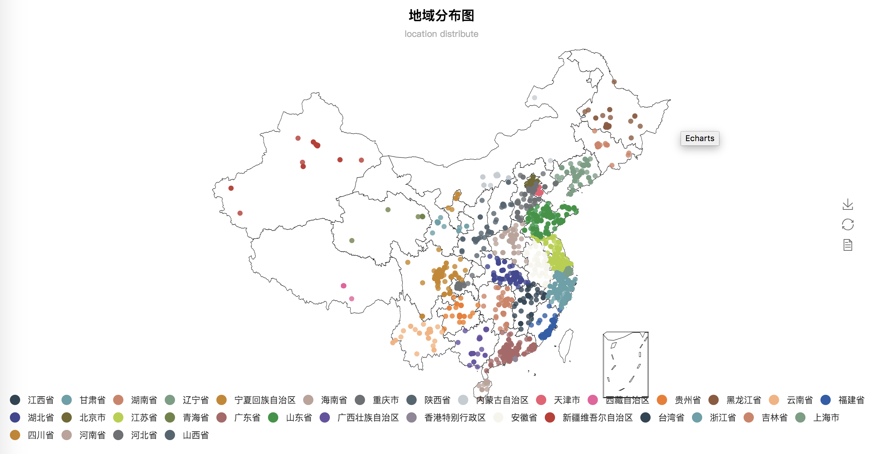

# addressparser
中文地址提取工具，支持中国三级区划地址（省、市、县）提取和映射，支持地址目的地热力图绘制。python3开发。


## Feature
#### 地址提取


    ["徐汇区虹漕路461号58号楼5楼", "福建泉州市洛江区万安塘西工业区"]
            ↓ 转换
    |省    |市   |区    |地址                |
    |上海市|上海市|徐汇区|虹漕路461号58号楼5楼  |
    |福建省|泉州市|洛江区|万安塘西工业区        |

> 注：“地址”列代表去除了省市区之后的具体地址

## Demo

https://www.borntowin.cn/product/address_extraction/

## Data
#### 中国三级行政区划分

数据源：爬取自[中华人民共和国民政局全国行政区划查询平台](http://xzqh.mca.gov.cn/map)

数据文件存储在：[addressparser/resources/pca.csv](./addressparser/resources/pca.csv)，数据为2019年2月20日在官网上爬取的最新权威数据


## Install
```
pip3 install addressparser
```

or

```
git clone https://github.com/shibing624/addressparser.git
cd addressparser
python3 setup.py install
```

## Usage

- 省市县提取
```python

location_str = ["徐汇区虹漕路461号58号楼5楼", "泉州市洛江区万安塘西工业区", "朝阳区北苑华贸城"]
import addressparser
df = addressparser.transform(location_str)
print(df)
```

output:
```
       省     市    区          地址
    0 上海市 上海市  徐汇区     虹漕路461号58号楼5楼
    1 福建省 泉州市  洛江区     万安塘西工业区
    2 北京市 北京市  朝阳区     北苑华贸城
```
> 程序的此处输入`location_str`可以是任意的可迭代类型，如list，tuple，set，pandas的Series类型等;

> 输出的`df`是一个Pandas的DataFrame类型变量，DataFrame可以非常轻易地转化为csv或者excel文件，Pandas的官方文档：http://pandas.pydata.org/pandas-docs/version/0.20/dsintro.html#dataframe


- 带位置索引的省市县提取

```python
location_str = ["徐汇区虹漕路461号58号楼5楼", "泉州市洛江区万安塘西工业区", "朝阳区北苑华贸城"]
import addressparser
df = addressparser.transform(location_str, pos_sensitive=True)
print(df)
```

output:

```
     省    市    区        地址                  省_pos  市_pos 区_pos
0  上海市  上海市  徐汇区  虹漕路461号58号楼5楼   -1     -1      0
1  福建省  泉州市  洛江区  万安塘西工业区         -1      0      3
2  北京市  北京市  朝阳区  北苑华贸城             -1     -1      0
```


- 全文模式的省市县提取

```python
location_str = ["浙江省杭州市下城区青云街40号3楼"]
import addressparser
df = addressparser.transform(location_str)
print(df)
```

output:

```
     省    市      区    地址
0  浙江省  杭州市  城区  下城区青云街40号3楼
```

这种错误的结果是因为jieba本身就将词给分错了，所以我们引入了全文模式，不进行分词，直接全文匹配，使用方法如下:


```python
location_str = ["浙江省杭州市下城区青云街40号3楼"]
import addressparser
df = addressparser.transform(location_str, cut=False)
print(df)
```

output:

```
   省       市     区         地址
0  浙江省  杭州市  下城区     青云街40号3楼
```
> 默认情况下transform方法的cut参数为True，即采用分词匹配的方式，这种方式速度比较快，但是准确率可能会比较低；
> 如果追求准确率而不追求速度的话，建议将cut设为False。


再举一个需要全文匹配的例子：

```python
import addressparser
df = addressparser.transform(["11月15日早上9点到11月18日下班前王大猫。在观山湖区"], cut=False, pos_sensitive=True)
print(df)
```

output:

```
    省     市      区        地址                                              省_pos 市_pos 区_pos
0  贵州省  贵阳市  观山湖区  11月15日早上9点到11月18日下班前王大猫。在观山湖区     -1     -1     25
```

- 地址经纬度、省市县级联关系查询

```python
## 查询经纬度信息
from addressparser import latlng
latlng[('北京市','北京市','朝阳区')] #输出('39.95895316640668', '116.52169489108084')

## 查询含有"鼓楼区"的全部地址
from addressparser import area_map
area_map.get_relational_addrs('鼓楼区') #[('江苏省', '南京市', '鼓楼区'), ('江苏省', '徐州市', '鼓楼区'), ('福建省', '福州市', '鼓楼区'), ('河南省', '开封市', '鼓楼区')]
#### 注: city_map可以用来查询含有某个市的全部地址, province_map可以用来查询含有某个省的全部地址

## 查询含有"江苏省", "鼓楼区"的全部地址
from addressparser import province_area_map
province_area_map.get_relational_addrs(('江苏省', '鼓楼区')) # [('江苏省', '南京市', '鼓楼区'), ('江苏省', '徐州市', '鼓楼区')]
```

- 绘制echarts热力图

使用echarts的热力图绘图函数之前需要先用如下命令安装它的依赖（为了减少本模块的体积，所以这些依赖不会被自动安装）：

```
pip install pyecharts
pip install echarts-countries-pypkg
pip install pyecharts-snapshot
```

使用本仓库提供的一万多条地址数据[tests/addr.csv](./tests/addr.csv)测试：
```python
#读取数据
import pandas as pd
origin = pd.read_csv("tests/addr.csv")
#转换
import addressparser
addr_df = addressparser.transform(origin["原始地址"])
#输出
processed = pd.concat([origin, addr_df], axis=1)
processed.to_csv("processed.csv", index=False, encoding="utf-8")

from addressparser import drawer
drawer.echarts_draw(processed, "echarts.html")
```

output:
```
1) processed.csv：1万多地址的省市县提取结果
2）echarts.html：echarts热力图
```
浏览器打开`echarts.html`后：


- 绘制分类信息图


样本分类绘制函数，通过额外传入一个样本的分类信息，能够在地图上以不同的颜色画出属于不同分类的样本散点图，以下代码以“省”作为类别信息绘制分类散点图（可以看到，属于不同省的样本被以不同的颜色标记了出来，这里以“省”作为分类标准只是举个例子，实际应用中可以选取更加有实际意义的分类指标）：

```python
from addressparser import drawer
drawer.echarts_cate_draw(processed, processed["省"], "echarts_cate.html")
```

浏览器打开输出的`echarts_cate.html`后：



## Command line usage
- 命令行模式
支持批量提取地址的省市县信息：
```
python3 -m addressparser address_input.csv -o out.csv

```
> 输入文件：`address_input.csv`；输出文件：`out.csv`，省市县地址以`\t`间隔


## Todo
- [x] bug修复，吉林省、广西省部分地址和上海浦东新区等三级区划地址匹配错误
- [x] 增加定期从民政局官网，统计局官网爬取最新省市县镇村划分的功能，延后，原因是2018年后官网未更新
- [ ] 解决路名被误识别为省市名的问题，eg"天津空港经济区环河北路80号空港商务园东区"


## Contribute

项目代码还很粗糙，如果大家对代码有所改进，欢迎提交回本项目
，在提交之前，注意以下两点：

 - 在`tests`添加相应的单元测试
 - 使用`python setup.py test`来运行所有单元测试，确保所有单测都是通过的

之后即可提交PR。

## Reference

* [chinese_province_city_area_mapper](https://github.com/DQinYuan/chinese_province_city_area_mapper)
* [smartParsePro](https://github.com/wzc570738205/smartParsePro)